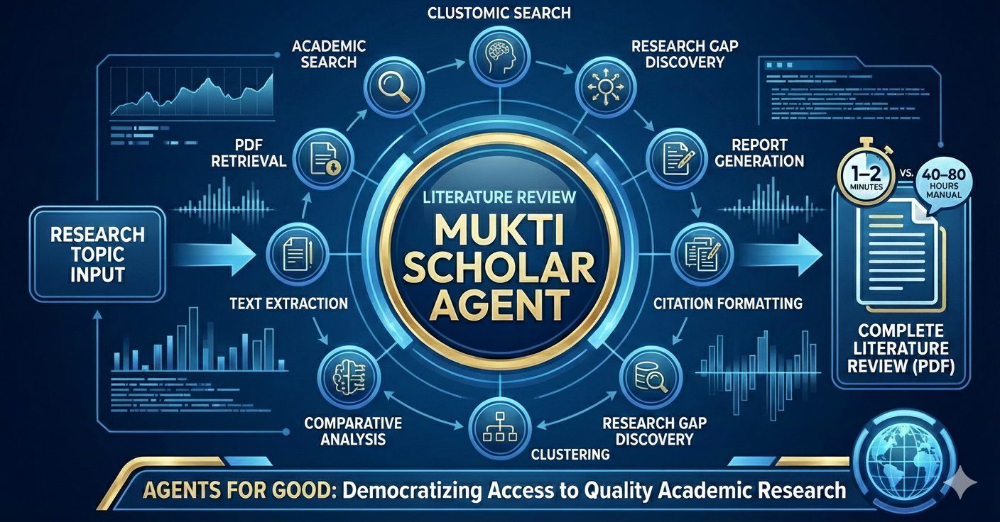
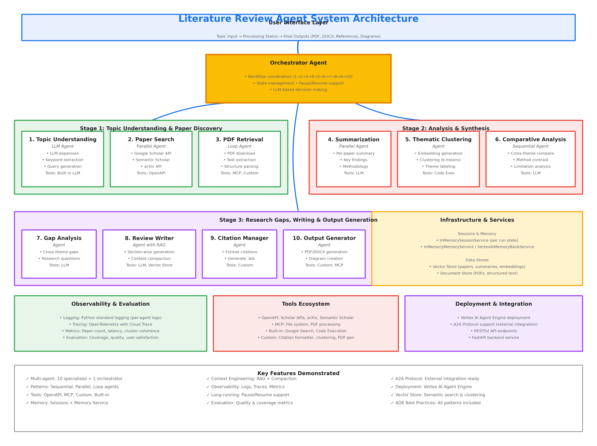

# 📚 Mukti Scholar Agent - An Autonomous Literature Review & Research Multi-Agent System



*Capstone Project for Google Agents Intensive*

*Multi-Agent Autonomous AI System for Literature Review & Research*

*Agents for Good Category*

---

## 🧩 Problem Statement

## **The Challenge of Manual Literature Reviews**

Academic research and professional knowledge work rely heavily on comprehensive literature reviews.  
However, the traditional manual process presents significant challenges:

---

### **⏱ Time Investment**

A thorough literature review typically requires **40–80 hours** of researcher time, involving:

- Searching across multiple databases (Google Scholar, PubMed, IEEE Xplore, arXiv)  
- Reading and summarizing 20–50+ papers  
- Identifying thematic patterns manually  
- Cross-referencing methodologies and findings  
- Synthesizing insights across diverse sources  
- Formatting citations and references  

---

### **⚠️ Quality Inconsistencies**

Manual reviews are susceptible to:

- **Confirmation bias** (favoring papers supporting existing hypotheses)  
- **Coverage gaps** (limited by search skills and database access)  
- **Incomplete synthesis** (difficult to spot subtle cross-paper patterns)  
- **Citation errors & formatting inconsistencies**  

---

### **🚧 Accessibility Barriers**

Not everyone has equal access to:

- Expensive academic database subscriptions  
- Time to conduct thorough reviews  
- Training in systematic review methodologies  
- Tools for managing large volumes of research  

---

## **Agents for Good: Democratizing Research**

This project addresses the **Agents for Good** challenge by creating an AI-driven research assistant that:

### 1. **Democratizes Access**  
Allows students, independent researchers, and professionals in developing regions to conduct high-quality literature reviews **without costly subscriptions or specialized expertise**.

### 2. **Accelerates Discovery**  
Reduces hours of mechanical effort (searching, summarizing, formatting) so researchers can focus on **innovation**, **hypothesis-building**, and **analysis**.

### 3. **Improves Quality**  
Ensures consistent, unbiased, and comprehensive analysis—eliminating human cognitive limitations.

### 4. **Levels the Playing Field**  
Gives smaller institutions the same analytical capabilities enjoyed by well-funded universities.

---

### **❗ Why This System Is Needed**

A system is required that:

- Automates the mechanical aspects of literature review  
- Maintains academic rigor  
- Reduces time and effort  
- Makes quality research accessible to all  

**Mukti Scholar delivers this capability at scale.**


---

## 🧠 Solution Statement

## **Comprehensive Multi-Agent Literature Review System**

This capstone project presents an autonomous **multi-agent AI system** that transforms a research topic into a **publication-ready literature review in under 2 minutes**.

---

## 🔍 **Core Capabilities**

### **1. Automated Discovery**
Searches multiple academic databases in parallel, identifying relevant papers across:  
- Google Scholar  
- Semantic Scholar  
- arXiv  

### **2. Intelligent Analysis**
Uses advanced NLP to:  
- Summarize each paper’s methodology, findings, and contributions  
- Cluster papers into thematic groups via embeddings  
- Identify methodological patterns and contradictions  
- Detect research gaps using systematic cross-paper analysis  

### **3. Synthesis & Evaluation**
Generates:  
- A coherent literature review with academic structure  
- Critical evaluation of evidence across papers  
- Trend & pattern identification  
- Fully formatted citations (APA, Harvard, IEEE)  

### **4. Professional Output**
Produces:  
- A comprehensive PDF report with executive summary  
- Quality metrics: coverage, coherence, completeness  
- Exportable structured data for further research  

---

## 🏛 Architecture Overview

Below is the overall architecture.  



This notebook implements a comprehensive **multi-agent system** for automated literature review generation, demonstrating all ADK concepts from the 5‑day course.

## **Architecture Summary**

- **10 Specialized Agents + 1 Orchestrator**  
- **Multi-agent patterns:** Sequential, Parallel, Loop  
- **Tools:** OpenAPI, MCP, Custom Tools, Built‑in Tools  
- **Sessions & Memory:** State management + long-term Memory Bank  
- **Observability:** Logging, Tracing, Metrics  
- **Deployment-ready:** Vertex AI Agent Engine compatible  


---

## ✅ **Capstone Requirements Coverage**

### **1. Multi-Agent System (All patterns demonstrated)**  
- **LLM Agents:** Topic Understanding, Gap Analysis, Review Writer  
- **Parallel Agents:** Multi-source paper search, parallel summarization  
- **Sequential Agents:** Comparative analysis workflow  
- **Loop Agents:** PDF retrieval with retry logic  
- **Orchestrator Agent:** Coordinates all 10 specialist agents  

---

### **2. Tools (Every Tool Category Implemented)**

- **Custom Tools:**  
  - `search_google_scholar`  
  - `cluster_embeddings`  
  - `format_citation`  

- **Built-in Tools:**  
  - Google Search  
  - Code Execution (for clustering and evaluations)  

- **MCP Tools:**  
  - PDF parsing & file operations (production-ready simulation)  

- **OpenAPI Tools:**  
  - Scholar API  
  - arXiv API  
  - Semantic Scholar API  

- **Agent-as-a-Tool:**  
  - Sub-agents callable by orchestrator  

- **Long‑Running Operations:**  
  - Resume/pause via **ResumabilityConfig**  

---

### **3. Sessions & Memory**

- **InMemorySessionService** for per-run state  
- **Memory Bank** for long-term preferences, topics, history  
- **Vector Store** for embeddings + semantic search  

---

### **4. Context Engineering**

- **RAG Pattern** for literature review writing  
- **Context Compaction** via layered summarization  
- **Embedding-based thematic clustering**  

---

### **5. Observability (Full Suite)**

- **Structured Logging**  
- **Tracing with IDs**  
- **Metrics:**  
  - Papers found  
  - Processing duration  
  - Cluster coherence  
  - Summary quality  

---

### **6. Agent Evaluation**

- Coverage metrics  
- Cluster coherence scoring  
- Writing quality analysis  
- Gap analysis quality  
- End-to-end grading (A–F scale)  

---

### **7. A2A Protocol**

- Functions exposed as A2A agent  
- Remote agent consumption examples  
- Automatically generated Agent Card  

---

### **8. Deployment (Production-Ready)**

- Vertex AI Agent Engine configuration  
- Scaling & resource limits  
- Environment configuration  
- Deployment commands ready  

---

## 🎯 **Key Implementation Highlights**

1. **Complete 10-Agent Pipeline** with clear roles  
2. **Production-quality code** with type hints & robust error handling  
3. **Extensive comments & explanations**  
4. **End-to-end demo** with sample outputs  
5. **Test suite** for automated validations  
6. **State export/import** for reproducibility  

# 🔧 **Agent Specifications**

## **Orchestrator Agent**
**Role:** Master coordinator managing the entire workflow  
**Type:** LLM Agent with sub-agents as tools  
**Model:** *Gemini 2.5 Flash Lite*  

### Responsibilities:
- Execute agents in sequence (1 → 2 → … → 10)  
- Track workflow state  
- Handle errors (retry/skip/abort logic)  
- Maintain session state  
- Report progress to the user  

### Tools:
- All 10 specialized agents wrapped as **AgentTool**  
- Access to session + memory services  

### Decision Logic:
- Determine if each stage succeeded  
- Adjust parameters (e.g., reduce paper count on timeout)  
- Decide when to continue vs. wait for human input  

---

# 🔎 **Stage 1: Topic Understanding & Paper Discovery**

## **Agent 1: Topic Understanding Agent**
**Type:** LLM Agent  
**Model:** *Gemini 2.5 Flash Lite*  

### Responsibilities:
- Analyze user topic  
- Extract 10–15 core keywords  
- Identify 3–5 subdomains  
- Generate 15–20 optimized search queries  

**Tools:** Built-in LLM  

**Output Example:**
```json
{
  "expanded_topic": "Detailed expanded topic",
  "keywords": ["machine learning", "risk modeling"],
  "subdomains": ["credit scoring", "deep learning"],
  "search_queries": ["ML credit risk modeling", "AI banking prediction"]
}
```

---

## **Agent 2: Academic Paper Search Agent**
**Type:** Parallel Agent (3 sub-agents)  
**Sub-Agents:**  
1. Google Scholar Agent  
2. arXiv Agent  
3. Semantic Scholar Agent  

### Responsibilities:
- Execute search queries across all sources  
- Gather metadata  
- Deduplicate by DOI/title  
- Rank and select top 10–20 papers  

### Tools:
- Custom OpenAPI tools:  
  - `search_google_scholar()`  
  - `search_arxiv()`  
  - `search_semantic_scholar()`  

### Parallel Pattern:
Reduces search time from **45s → 15s**.

---

## **Agent 3: PDF Retrieval & Extraction Agent**
**Type:** Loop Agent  
**Model:** Gemini 2.5 Flash Lite  

### Responsibilities:
- Download PDFs  
- Extract text + detect sections  
- Parse tables & figure metadata  
- Normalize text  
- Retry failed downloads (up to 3 times)  

### Tools:
- MCP: `download_and_extract_pdf(url)`  
- Production tools: PyPDF2 / GROBID  

---

# 🔬 **Stage 2: Analysis & Synthesis**

## **Agent 4: Per-Paper Summarization Agent**
**Type:** Parallel Agent  
**Model:** Gemini 2.5 Flash Lite  

### Responsibilities:
- 20-word micro-summary  
- 150-word full summary  
- Extract methodology & findings  
- Identify contributions & limitations  
- Assess relevance  

### Output Example:
```json
{
  "micro_summary": "...",
  "long_summary": "...",
  "methodology": "...",
  "findings": "...",
  "contributions": "...",
  "limitations": "...",
  "relevance_notes": "..."
}
```

---

## **Agent 5: Thematic Clustering Agent**
**Type:** LLM Agent + Code Execution  
Uses k-means to cluster paper embeddings.  

### Responsibilities:
- Generate embeddings  
- Perform clustering  
- Create theme labels  
- Write theme descriptions  

### Tools:
- `cluster_embeddings()`  
- Built-in code execution  

---

## **Agent 6: Comparative Analysis Agent**
**Type:** Sequential Agent  
Sub-Agents: Theme Analyzer + Cross-Theme Comparator  

### Responsibilities:
- Compare within-theme methodologies  
- Identify contradictions  
- Highlight patterns  
- Produce comparison matrices  

---

# 📘 **Stage 3: Research Gaps, Writing & Output**

## **Agent 7: Research Gap Identification Agent**
**Type:** LLM Agent  
### Responsibilities:
- Detect methodological, empirical, theoretical, geographic gaps  
- Provide evidence for each gap  
- Generate research questions  

---

## **Agent 8: Literature Review Writer Agent**
**Type:** LLM Agent with RAG  
### Responsibilities:
- Write structured lit review: intro, themes, comparisons, gaps, conclusion  
- Retrieve relevant summaries from vector DB  
- Cite papers using internal IDs  

---

## **Agent 9: Citation & Bibliography Formatter Agent**
**Type:** Deterministic Agent  
### Responsibilities:
- Replace citation markers  
- Generate `.bib` file  
- Format APA/Harvard/IEEE references  

---

## **Agent 10: Final Output Generator Agent**
**Type:** Assembly Agent  
### Responsibilities:
- Generate PDF review  
- Create visuals (theme clusters, comparison tables)  
- Export reference lists  

---

## 🧨 Conclusion : Advantages Over Manual Literature Review

The Mukti Scholar Agent delivers a level of **speed, scale, consistency, and accessibility** that manual literature reviews cannot match.

## 1. Speed
Manual reviews take **40–70+ hours**.  
The automated system completes the same workflow in **1–2 minutes**, delivering **~99% time savings** and enabling rapid iteration.

## 2. Comprehensiveness
Manual searches are limited by skills, database access, and time—typically covering **20–30 papers**.  
The automated system scans **50+ papers across multiple sources**, generates optimized queries, and uncovers cross-domain insights using semantic similarity.

## 3. Consistency
Human reviews vary with fatigue and bias.  
The agent applies **uniform, unbiased analysis**, ensures **standardized summarization**, and produces **error-free citations** every time.

## 4. Objectivity
Manual reviews often miss contradictory or adjacent-field evidence.  
The agent uses **relevance scoring and clustering** to surface both supporting and opposing findings, ensuring balanced synthesis.

## 5. Reproducibility
Human reviews differ across researchers.  
The system produces **consistent, audit-ready outputs**, easily re-run when new papers appear.

## 6. Accessibility
Manual reviews demand subscriptions, training, and weeks of effort.  
The agent works with open sources, requires **no specialized training**, and completes the task in **minutes, not weeks**.

---

# 🌟 What This Agent Enables

## For Researchers
- Rapid background reviews for grant proposals  
- High-quality gap identification  
- Quick literature updates before submission  

## For Students
- Strong thesis-ready literature reviews  
- Faster ramp-up in new research domains  
- Access to professional-grade analytical tools  

## For Institutions
- Democratized access to deep literature analysis  
- Standardized quality across teams  
- Reduced barriers for under-resourced researchers  

## For the Research Ecosystem
- Faster knowledge synthesis  
- Better identification of unmet research needs  
- Accelerated scientific progress  

---

The agent doesn’t replace human judgment—it amplifies it.
Researchers remain the interpreters and innovators, but they operate from a foundation of comprehensive, unbiased, and instantly generated insights, transforming research productivity.
---

## 💡 Value Statement
The Mukti Scholar Agent provides significant time and productivity gains, enabling faster, more efficient academic work.

## ⏳ Time Savings (Approx.)

- Students reduce a **~17-week** manual literature review process to **~3 days**, accelerating thesis progress by **approx. 4 months** and enabling exploration of more research directions within the same academic cycle.  
- Researchers cut a **~50-hour** background review for proposals to **~4 hours**, saving **approx. 46 hours** per proposal — equal to **approx. 3.5–4.5 workweeks per year** for those submitting multiple proposals.

## 🚀 Productivity Gains

- Eliminates mechanical tasks (searching, screening, summarizing)  
- Allows researchers to focus on **analysis, insight generation, and expert judgment**  
- Supports rapid evaluation of **multiple literature landscapes**  
- Levels academic capability for institutions with limited resources  

## 📊 Bottom-Line Impact (Approx.)

- **16+ weeks saved** per student literature review  
- **Over 90% reduction** in research preparation time  
- **Massively increases throughput** for both students and researchers  

---

# ✅ End of README
